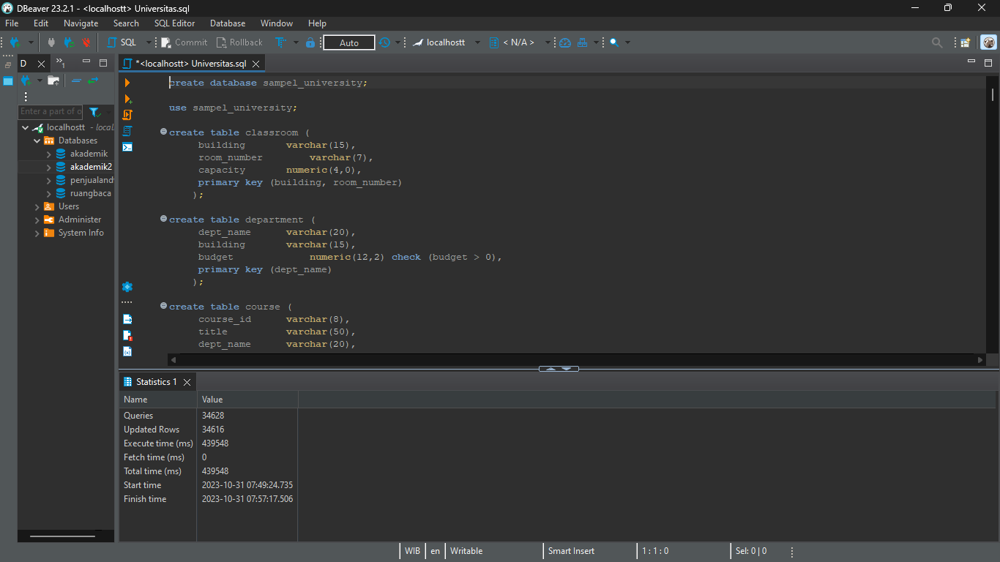
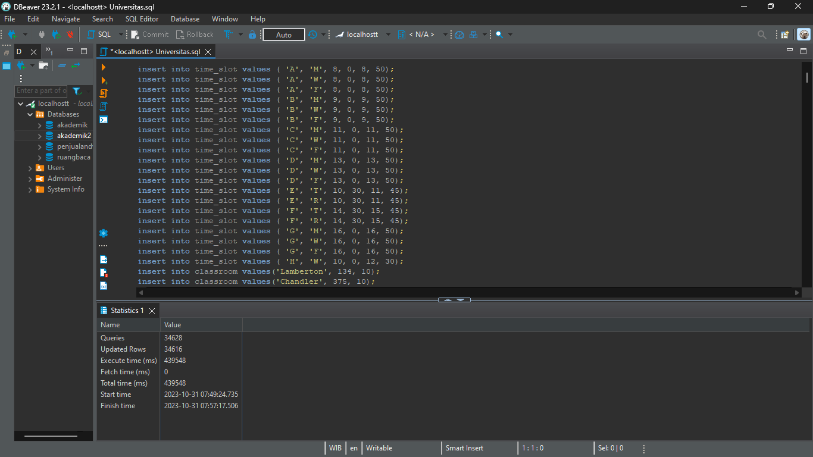
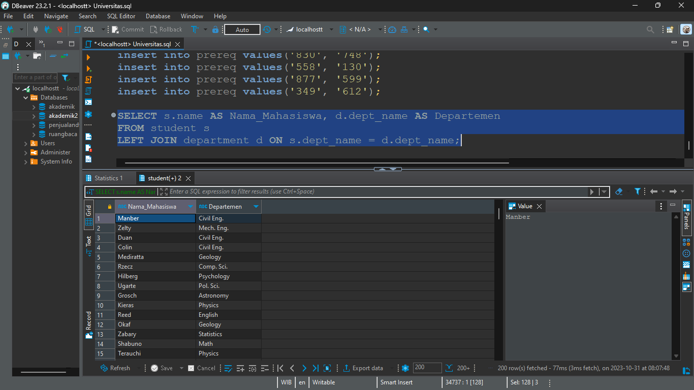
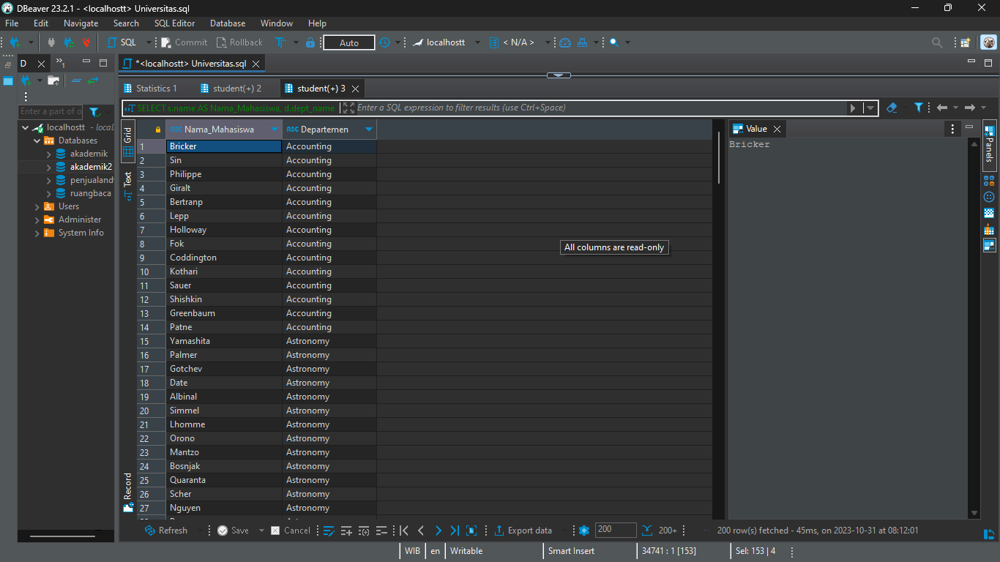
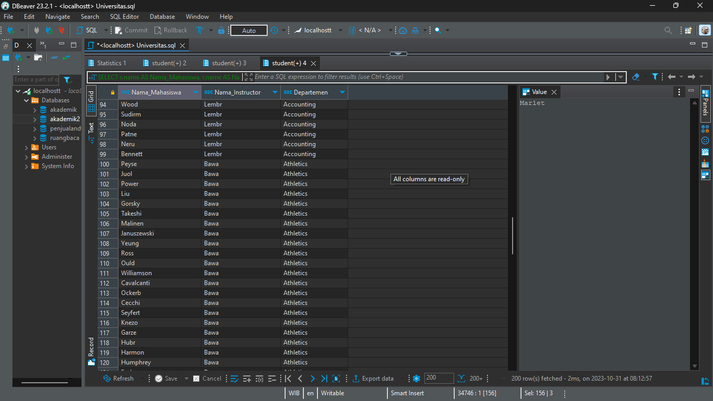

# MODUL 3 DASAR BASIS DATA

# ✍ Langkah Pengerjaan ✍

<b>1. Mengunduh data universitas yang telah disediakan dan salin di Dbeaver.</b>
  Setelah menyalin kode SQL, jalankan menggunakan <i>"Execute SQL Script"</i> di DBeaver.
 Silahkan buka data universitas dengan mengklik tautan berikut : [[Kode SQL]](./Universitas.sql)

   

<b>2. Menampilkan Nama Mahasiswa dan Nama Departemen</b>
 Untuk menampilkan dapat menggunakan perintah SQL dibawah:

    SELECT s.name AS Nama_Mahasiswa, d.dept_name AS Departemen
    FROM student s
    LEFT JOIN department d ON s.dept_name = d.dept_name;

<b>2. Menampilkan Nama Student dengan Total SKS Lebih dari 100.</b>
 Untuk menampilkan dapat menggunakan perintah SQL dibawah:

    SELECT s.name AS Nama_Mahasiswa, d.dept_name AS Departemen
    FROM student s
    INNER JOIN department d ON s.dept_name = d.dept_name
    WHERE s.tot_cred > 100;

    
<b>3. Menampilkan Nama Mahasiswa dan Nama Departemen.</b>
 Untuk menampilkan dapat menggunakan perintah SQL dibawah:

    SELECT s.name AS Nama_Mahasiswa, i.name AS Nama_Instructor, s.dept_name AS Departemen
    FROM student s
    INNER JOIN instructor i ON s.dept_name = i.dept_name;

