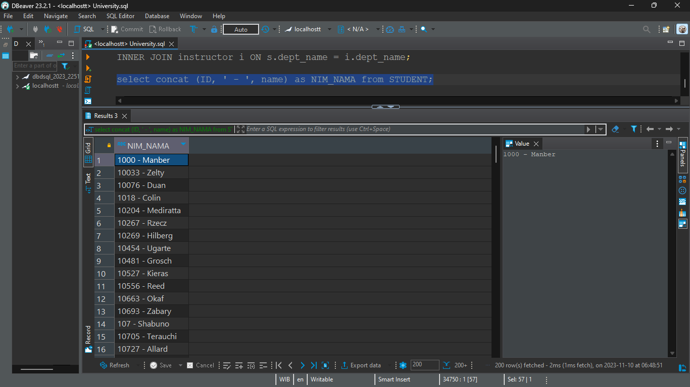
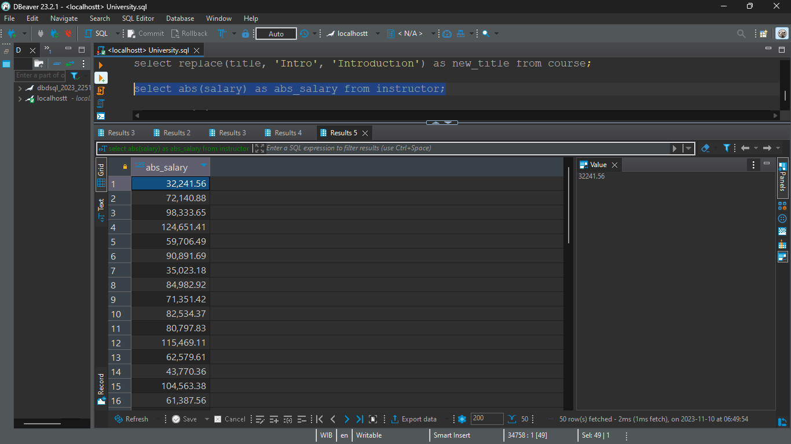
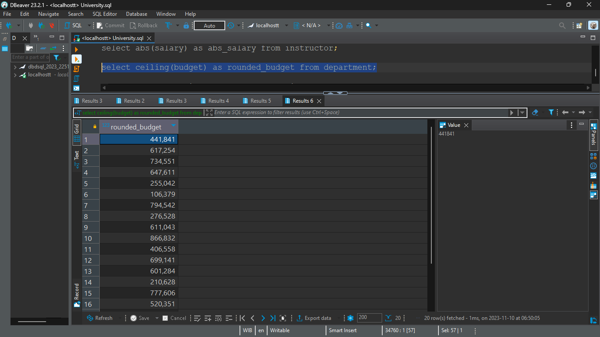
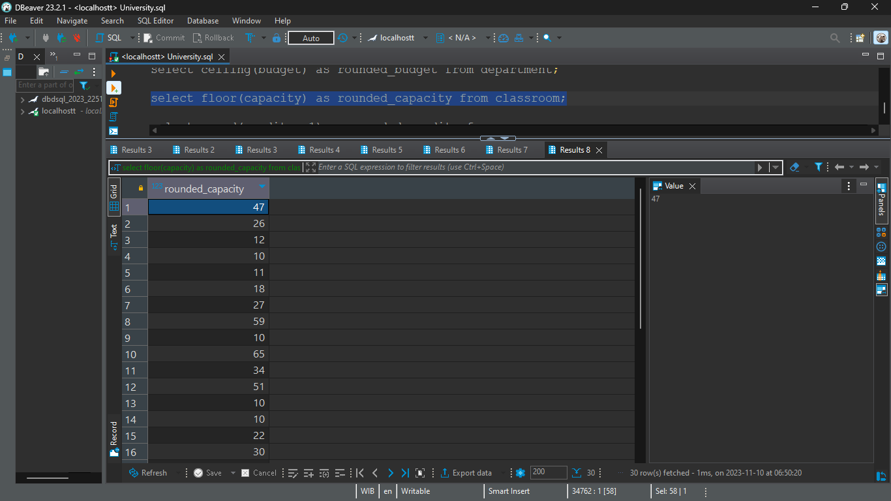
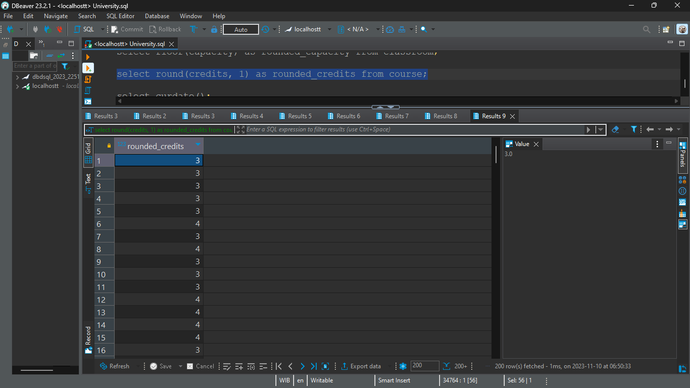
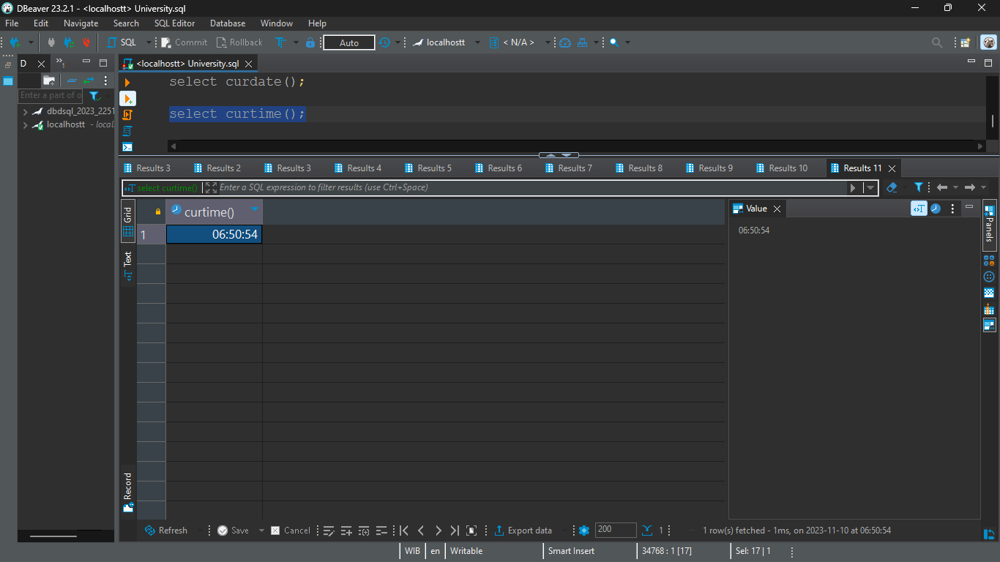
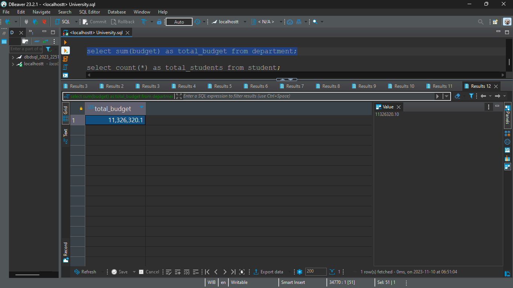
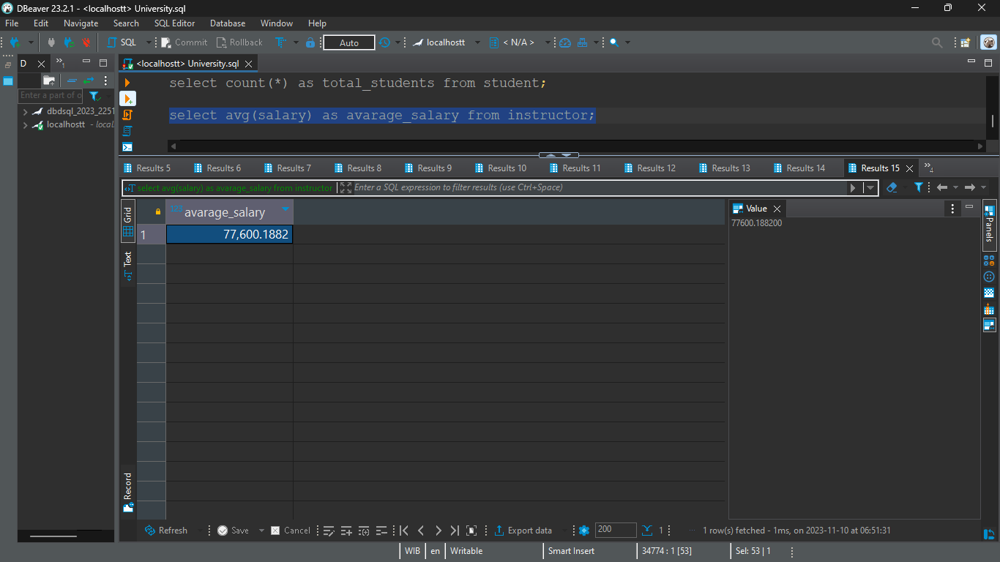
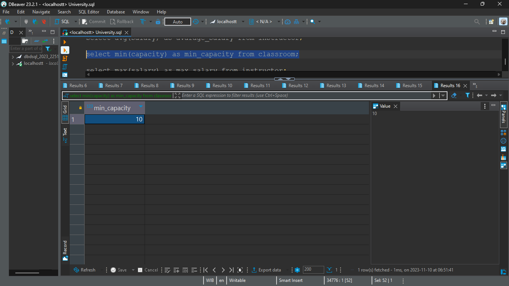
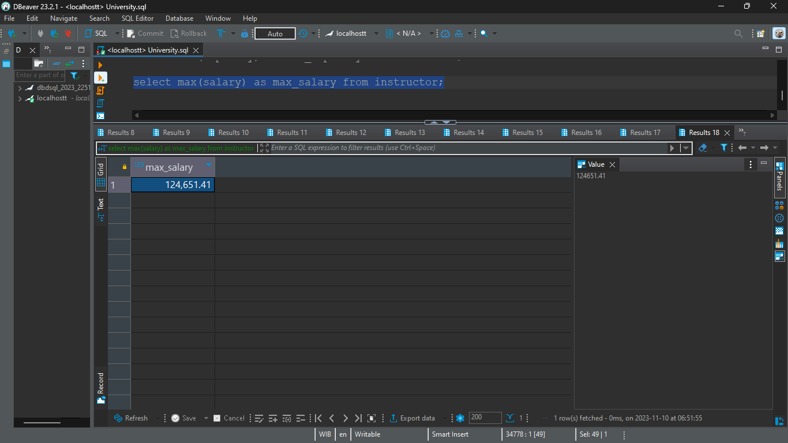

# MODUL 4: FUNGSI SKALAR DAN AGREGASI
<b>Fungsi skalar</b> dalam SQL digunakan untuk mengembalikan nilai tunggal (single value) dari suatu nilai input yang diberikan.
<br><b>Fungsi Agregasi</b> dalam SQL digunakan untuk melakukan perhitungan pada sekelompok nilai dan kemudian mengembalikan nilai tunggal.


# ✍ Langkah Pengerjaan ✍

<b>1. Mengunduh data universitas yang telah disediakan dan salin di Dbeaver.</b>
<br> Setelah menyalin kode SQL, jalankan menggunakan <i>"Execute SQL Script"</i> di DBeaver. Silahkan buka data universitas dengan mengklik tautan berikut : [[Kode SQL]](./sample_university.sql)

<b>2. Menjalankan Fungsi Skalar </b>
<br> Berikut langkah-langkah untuk menjalankan fungsi skalar

a. CONCAT ()
<br> CONCAT digunakan untuk menggabungkan dua atau lebih string menjadi satu string tunggal.

```sql 
select concat (ID, ' - ', name) as NIM_NAMA 
from STUDENT;
```


b. SUBSTR ()
<br> SUBSTR atau Substring  digunakan untuk mengambil sebagian substring dari suatu string.

```sql 
select substr(dept_name, 1, 7) as Jurusan 
from department;
```


c. LENGTH ()
<br> LENGTH digunakan untuk menghitung panjang atau jumlah karakter dari sebuah string.

```sql 
select length (building) as building_length 
from classroom;
```


d. REPLACE ()
<br> REPLACE digunakan untuk mengganti string dengan string baru.

```sql 
select replace(title, 'Intro', 'Introduction') as new_title 
from course;
```

d. REPLACE ()
<br> REPLACE digunakan untuk mengganti string dengan string baru.

```sql 
select replace(title, 'Intro', 'Introduction') as new_title 
from course;
```


e. ABS ()
<br> ABS digunakan untuk menghitung nilai absolut dari suatu angka.

```sql 
select abs(salary) as abs_salary 
from instructor;
```


f. CEILING ()
<br> CEILING digunakan untuk membulatkan suatu angka ke angka terdekat yang lebih besar atau sama dengan angka tersebut.

```sql 
select ceiling(budget) as rounded_budget 
from department;
```


g. FLOOR ()
<br> FLOOR digunakan untuk membulatkan suatu angka ke angka terdekat yang lebih kecil atau sama dengan angka tersebut.

```sql 
select floor(capacity) as rounded_capacity 
from classroom;
```


h. ROUND ()
<br> ROUND digunakan untuk membulatkan suatu angka ke jumlah desimal tertentu.

```sql 
select round(credits, 1) as rounded_credits 
from course;
```


i. CURDATE ()
<br> CURDATE digunakan untuk menampilkan tanggal saat ini. 

```sql 
select curdate();
```


j. CURTIME ()
<br> CURTIME digunakan untuk menampilkan waktu saat ini.

```sql 
select curtime();
```



<b>3. Menjalankan Fungsi Agregasi </b>
<br> Berikut langkah-langkah untuk menjalankan fungsi agregasi

a. SUM ()
<br> SUM digunakan untuk menghitung total nilai dari suatu kolom numerik.

```sql 
select sum(budget) as total_budget 
from department;
```


b. COUNT ()
<br> COUNT digunakan untuk menghitung jumlah baris atau nilai non-null dalam suatu kolom.

```sql 
select count(*) as total_students 
from student;
```


c. AVG ()
<br> AVG digunakan untuk menghitung rata-rata dari nilai numerik dalam suatu kolom.

```sql 
select avg(salary) as avarage_salary 
from instructor;
```


d. MIN ()
<br> MIN digunakan untuk menemukan nilai terkecil dalam suatu kolom.

```sql 
select min(capacity) as min_capacity 
from classroom;
```


e. MAX ()
<br> MAX digunakan untuk menemukan nilai terbesar dalam suatu kolom.

```sql 
select max(salary) as max_salary 
from instructor;
```
