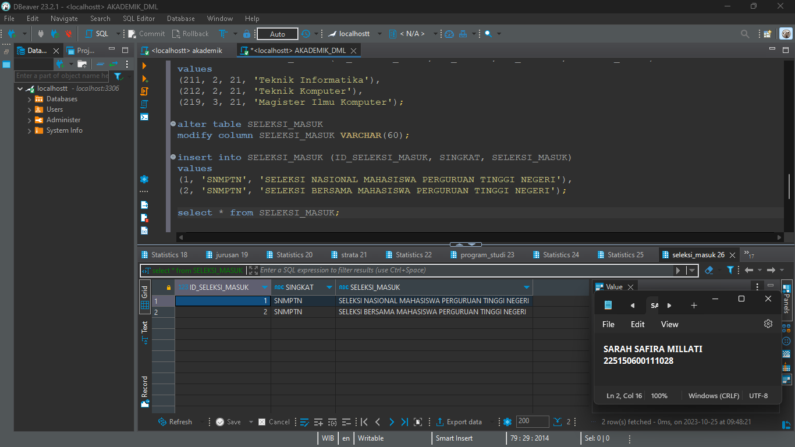

# MODUL 3 DASAR BASIS DATA

# 🪢 Langkah Pengerjaan 

1. Membuat Schema dan Table
<br>Schema ini akan digunakan untuk mengorganisir data dalam basis data. Berikut adalah SQL untuk membuat schema dan tabel.

    ```sql
    create schema AKADEMIK2;


2. Menggunakan Use AKADEMIK2
<br>Setelah schema AKADEMIK2 dibuat, kita perlu menggunakannya sebelum membuat tabel-tabel. Use memastikan bahwa semua tabel yang kita buat akan berada di dalam schema yang tepat.

     ```sql
    use AKADEMIK2;


3. Membuat Tabel STRATA
<br>Tabel STRATA akan digunakan untuk menyimpan informasi tentang tingkatan pendidikan.

    ```sql
    create table STRATA (
        ID_STRATA smallint not null primary key,
        SINGKAT VARCHAR(10),
        STRATA VARCHAR(45)
    );


4. Membuat Tabel FAKULTAS
<br>Tabel FAKULTAS akan digunakan untuk menyimpan informasi tentang fakultas-fakultas.

    ```sql
    create table FAKULTAS (
        ID_FAKULTAS smallint not null primary key,
        FAKULTAS VARCHAR(45)
    );


5. Membuat Tabel JURUSAN
<br>Tabel JURUSAN akan digunakan untuk menyimpan informasi tentang jurusan-jurusan.

    ```sql
    create table JURUSAN (
        ID_JURUSAN smallint not null primary key,
        ID_FAKULTAS smallint references FAKULTAS(ID_FAKULTAS),
        JURUSAN VARCHAR(45)
    );


6. Membuat Tabel PROGRAM_STUDI
<br>Tabel PROGRAM_STUDI akan digunakan untuk menyimpan informasi tentang program studi.

    ```sql
    create table JURUSAN (
        ID_JURUSAN smallint not null primary key,
        ID_FAKULTAS smallint references FAKULTAS(ID_FAKULTAS),
        JURUSAN VARCHAR(45)
    );


7. Membuat Tabel SELEKSI_MASUK
<br>Tabel SELEKSI_MASUK akan digunakan untuk menyimpan informasi tentang jenis seleksi masuk.

    ```sql
    create table SELEKSI_MASUK (
        ID_SELEKSI_MASUK smallint not null primary key,
        SINGKAT VARCHAR(12),
        SELEKSI_MASUK VARCHAR(45)
    );


8. Membuat Tabel MAHASISWA
<br>Tabel MAHASISWA akan digunakan untuk menyimpan informasi tentang mahasiswa.

    ```sql
    create table MAHASISWA (
        NIM VARCHAR(15) not null primary key,
        ID_SELEKSI_MASUK smallint references SELEKSI_MASUK(ID_SELEKSI_MASUK),
        ID_PROGRAM_STUDI smallint references PROGRAM_STUDI(ID_PROGRAM_STUDI),
        NAMA VARCHAR(45),
        ANGKATAN smallint,
        TGL_LAHIR DATE,
        KOTA_LAHIR VARCHAR (60),
        JENIS_KELAMIN CHAR(1)
    );


9. Mengisi Data ke Tabel FAKULTAS, JURUSAN, STRATA, PROGRAM_STUDI, dan SELEKSI_MASUK
<br>Selanjutnya, mengisi data ke dalam tabel-tabel yang telah dibuat.

9.1 Menambahkan Data ke Tabel FAKULTAS

    insert into FAKULTAS (ID_FAKULTAS, FAKULTAS)
    values 
    (1, 'Ekonomi dan Bisnis'),
    (2, 'Ilmu Komputer');

Selanjutnya, menampilkan data dari tabel FAKULTAS setelah menambahkan data. Di bawah ini adalah SQL untuk menampilkan.

    select * from FAKULTAS;
    


9.2 Menambahkan Data JURUSAN

    insert into JURUSAN (ID_JURUSAN, ID_FAKULTAS, JURUSAN)
    values 
    (21, 2, 'Informatika'),
    (22, 2, 'Sistem Informasi'),
    (23, 2, 'Teknik Komputer');

Selanjutnya, menampilkan data dari tabel JURUSAN setelah menambahkan data. Di bawah ini adalah SQL untuk menampilkan

    select * from JURUSAN;


9.3 Menambahkan Data STRATA

    insert into STRATA (ID_STRATA, SINGKAT, STRATA)
    values 
    (1, 'D1', 'Diploma'),
    (2, 'S1', 'Sarjana'),
    (3, 'S2', 'Magister');

Selanjutnya, menampilkan data dari tabel STRATA setelah menambahkan data. Di bawah ini adalah SQL untuk menampilkan

    select * from STRATA;


9.4 Menambahkan Data PROGRAM_STUDI
    
    insert into PROGRAM_STUDI (ID_PROGRAM_STUDI, ID_STRATA, ID_JURUSAN,          PROGRAM_STUDI)
    values 
    (211, 2, 21, 'Teknik Informatika'),
    (212, 2, 21, 'Teknik Komputer'),
    (219, 3, 21, 'Magister Ilmu Komputer');

Selanjutnya, menampilkan data dari tabel PROGRAM_STUDI setelah menambahkan data. Di bawah ini adalah SQL untuk menampilkan

    select * from PROGRAM_STUDI;


9.5 Mengubah tipe data kolom SELEKSI_MASUK menjadi VARCHAR(60)
    
    alter table SELEKSI_MASUK
    modify column SELEKSI_MASUK VARCHAR(60);


9.6 Menambahkan Data SELEKSI_MASUK
    
    insert into SELEKSI_MASUK (ID_SELEKSI_MASUK, SINGKAT, SELEKSI_MASUK)
    values
    (1, 'SNMPTN', 'SELEKSI NASIONAL MAHASISWA PERGURUAN TINGGI NEGERI'),
    (2, 'SNMPTN', 'SELEKSI BERSAMA MAHASISWA PERGURUAN TINGGI NEGERI');

Selanjutnya, menampilkan data dari tabel SELEKSI_MASUK setelah menambahkan data. Di bawah ini adalah SQL untuk menampilkan

    select * from SELEKSI_MASUK;


9.6 Menambahkan Data MAHASISWA
    
    INSERT INTO MAHASISWA (NIM, ID_SELEKSI_MASUK, ID_PROGRAM_STUDI, NAMA, ANGKATAN, TGL_LAHIR, KOTA_LAHIR, JENIS_KELAMIN)
    VALUES
        ('155150400', 1, 211, 'Joni', 2015, '1997-01-01', 'Malang', 'W'),
        ('155150401', 2, 212, 'Jono', 2015, '1997-10-02', 'Situbondo', 'P');

Selanjutnya, menampilkan data dari tabel SELEKSI_MASUK setelah menambahkan data. Di bawah ini adalah SQL untuk menampilkan

    select * from MAHASISWA;

