# MODUL 4: FUNGSI SKALAR DAN FUNGSI AGREGASI
<b>Fungsi skalar</b> dalam SQL digunakan untuk mengembalikan nilai tunggal (single value) dari suatu nilai input yang diberikan.
<br><b>Fungsi Agregasi</b> digunakan untuk melakukan perhitungan pada sekelompok nilai dan kemudian mengembalikan nilai tunggal.

# ✍ Langkah Pengerjaan ✍

<b>1. Mengunduh data universitas yang telah disediakan dan salin di Dbeaver.</b>
<br> Setelah menyalin kode SQL, jalankan menggunakan <i>"Execute SQL Script"</i> di DBeaver.
<br>Silahkan buka data universitas dengan mengklik tautan berikut : [[Kode SQL]](./sampel_universitas.sql)

<b>2. Menjalankan Fungsi Skalar </b> <br>

<b>a. Fungsi CONCAT()</b>
<br> Concat digunakan untuk menggabungkan dua atau lebih string menjadi satu string tunggal.

```sql
select concat (ID, ' - ', name) as NIM_NAMA
from STUDENT; 
```
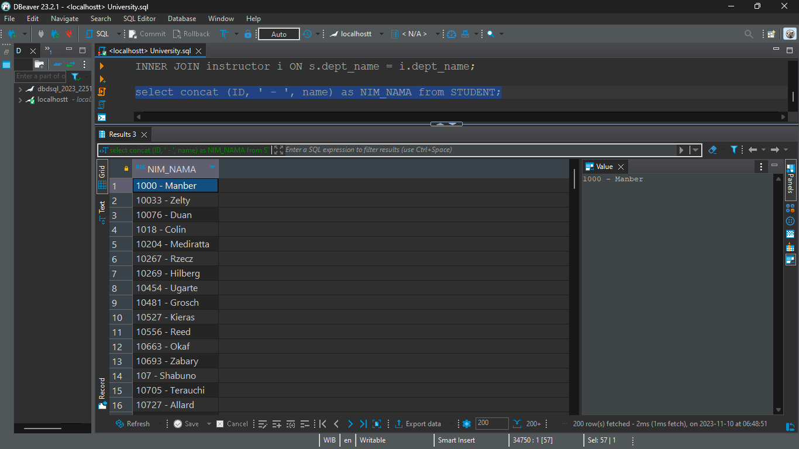

<b>b. Fungsi SUBSTR()</b>
<br> Substr atau substring digunakan untuk mengambil sebagian substring dari suatu string.

```sql
select substr(dept_name, 1, 7) as Jurusan 
from department; 
```
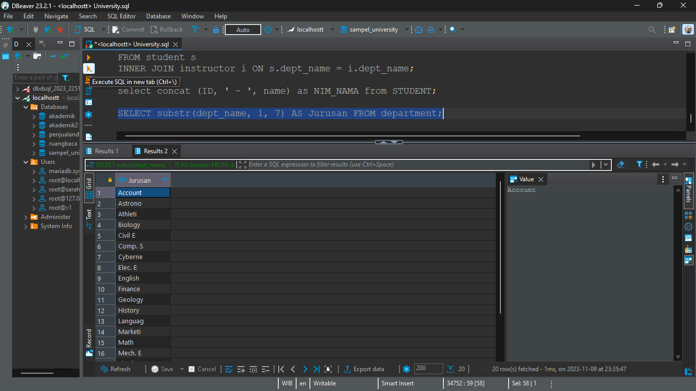

<b>c. Fungsi LENGTH()</b>
<br> Length digunakan untuk menghitung panjang atau jumlah karakter dari suatu string.

```sql
select length (building) as building_length 
from classroom; 
```
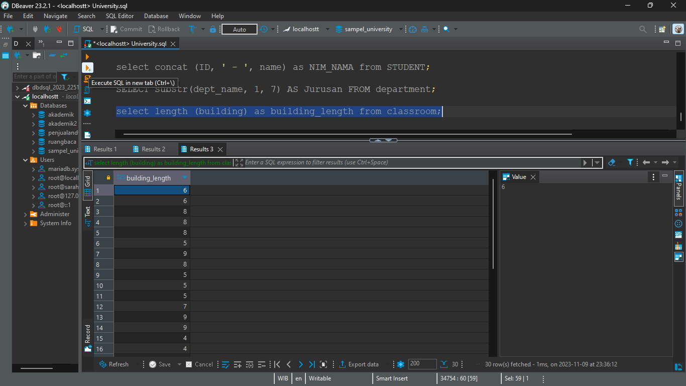

<b>d. Fungsi REPLACE()</b>
<br> Replace digunakan untuk mengganti string dengan string baru.

```sql
select replace(title, 'Intro', 'Introduction') as new_title 
from course; 
```
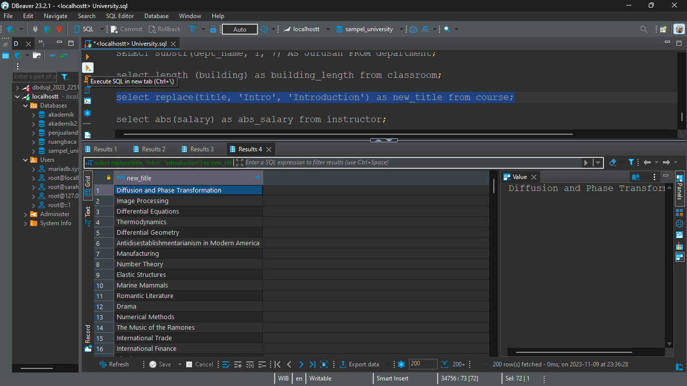

<b>2. Menjalankan Fungsi Agregasi </b> <br>

<b>a. Fungsi ABS()</b>
<br> Abs digunakan untuk menghitung nilai absolut dari suatu angka.

```sql
select abs(salary) as abs_salary 
from instructor;
```
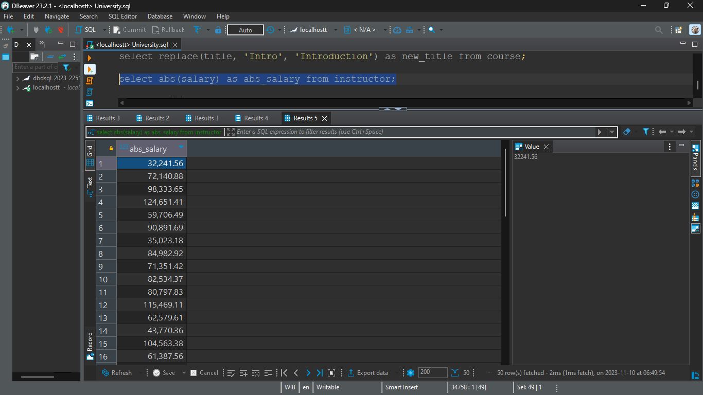

<b>b. Fungsi CEILING()</b>
<br> Ceiling digunakan untuk membulatkan angka ke atas yaitu ke integer terdekat yang lebih besar atau sama dengan angka tersebut.

```sql
select ceiling(budget) as rounded_budget 
from department;
```
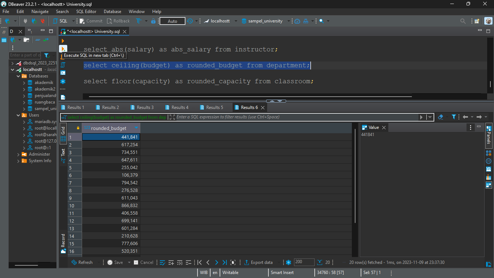

<b>c. Fungsi FLOOR()</b>
<br> Floor digunakan untuk membulatkan suatu angka ke bawah yaitu ke integer terdekat yang lebih kecil atau sama dengan angka tersebut.

```sql

select floor(capacity) as rounded_capacity 
from classroom; 
```
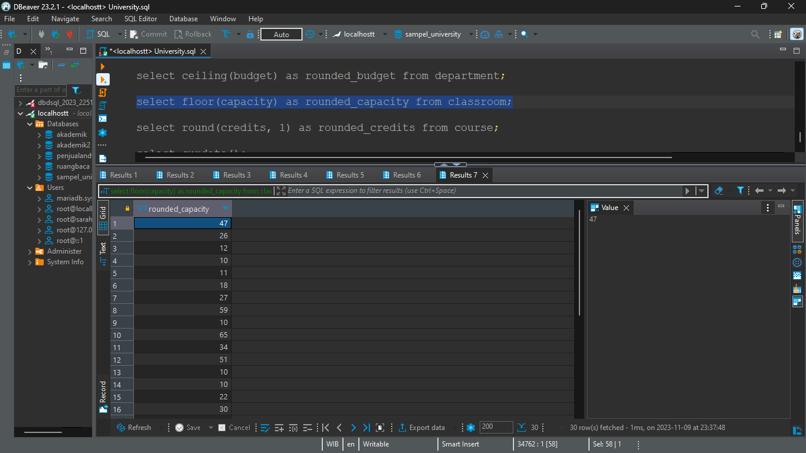

<b>d. Fungsi ROUND()</b>
<br> Round digunakan untuk membulatkan suatu angka ke jumlah desimal tertentu.

```sql
select round(credits, 1) as rounded_credits 
from course; 
```
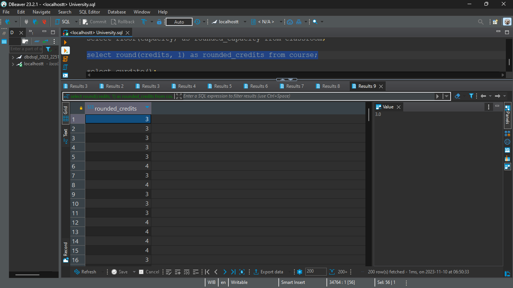

<b>e. Fungsi CURDATE()</b>
<br> Curdate digunakan untuk menampilkan tanggal saat ini.

```sql
select curdate(); 
```
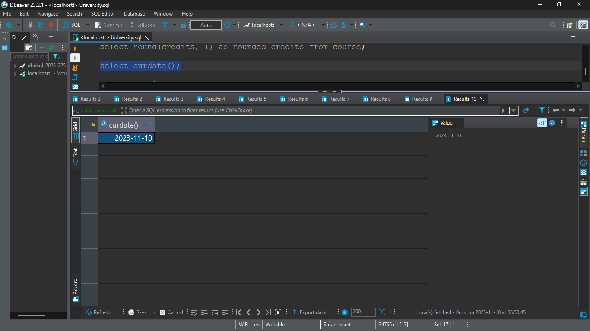

<b>f. Fungsi CURTIME()</b>
<br> Curtime digunakan untuk menampilkan waktu saat ini.

```sql
select curtime(); 
```
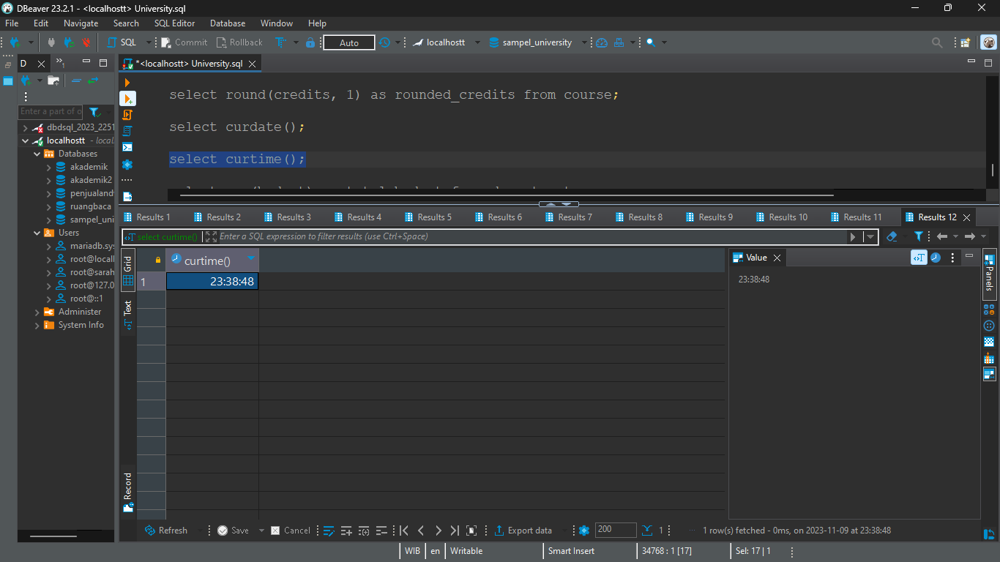

<b>g. Fungsi SUM()</b>
<br> Sum digunakan untuk menghitung nilai total dari suatu kolom.

```sql
select sum(budget) as total_budget 
from department; 
```
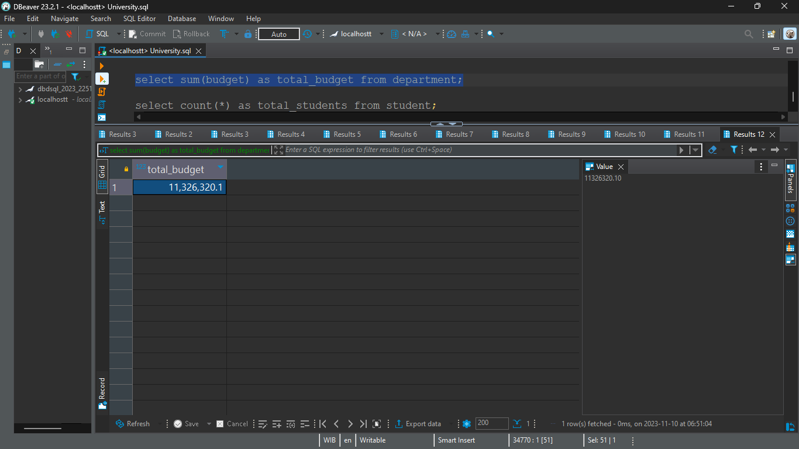

<b>g. Fungsi COUNT()</b>
<br> Count digunakan untuk menghitung jumlah baris atau nilai non-null dalam suatu kolom.
```sql
select count(*) as total_students 
from student;
```
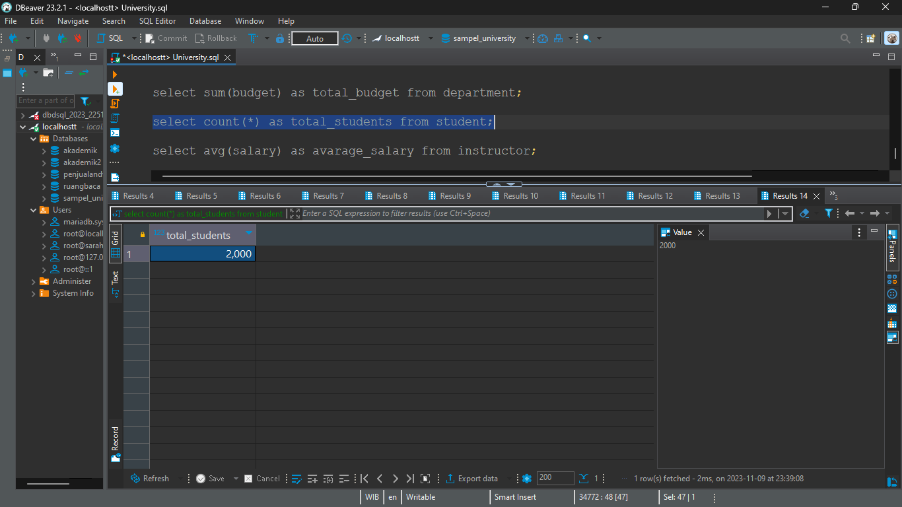

<b>h. Fungsi AVG()</b>
<br> Avg digunakan untuk menghitung rata-rata dari nilai pada suatu kolom.

```sql
select avg(salary) as avarage_salary 
from instructor; 
```
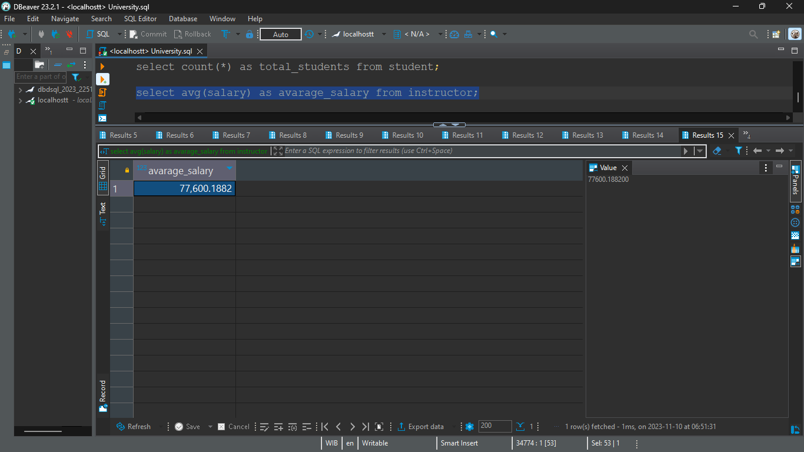

<b>i. Fungsi MIN()</b>
<br> Min digunakan untuk mencari nilai terkecil dalam suatu kolom.

```sql
select min(capacity) as min_capacity 
from classroom;
```
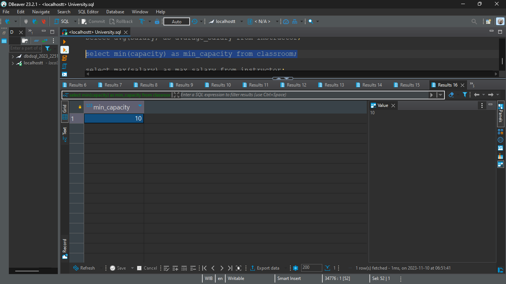

<b>j. Fungsi MAX()</b>
<br> Max digunakan untuk mencari nilai terkecil dalam suatu kolom.

```sql
select max(salary) as max_salary 
from instructor;
```
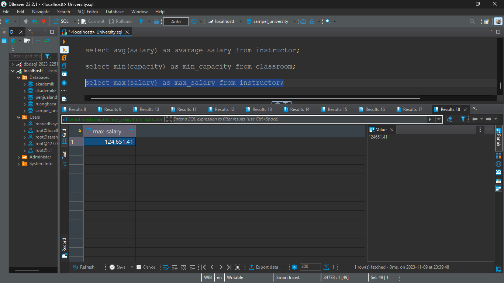

